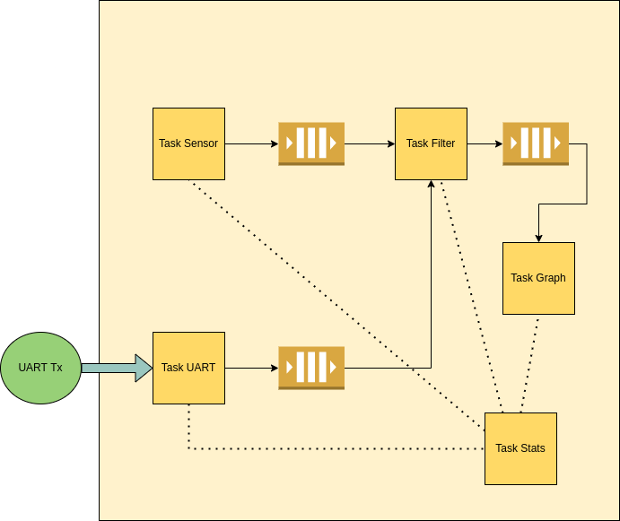

## Sistemas Operativos II - Laboratorio VII RTOS - Francisco Daniele
###  Ingeniería en Computación - FCEFyN - UNC
# Real Time Operating Systems

## Desarrollo
### Diagrama
Para tener una idea más clara y un punto de partida para desarrollar el laboratorio hice un pequeño diagrama de lo que sería el sistema a desarrollar


### Ambiente
Para facilitar el desarrollo, este proyecto se basa y usa varias configuraciones del demo proporcionado por FreeRTOS 'CORTEX_LM3S811_GCC' que es un programa para correr sobre la placa Stellaris LM3S811, la misma sobre la cual se emula este trabajo.
Se destacan los siguientes cambios realizados a dichas configuraciones para poder cumplir con las consignas del laboratorio:
-   FreeRTOSConfig.h:
    -   INCLUDE_uxTaskGetStackHighWaterMark: este flag se setea para poder utilizar la función uxTaskGetStackHighWaterMark la cuál nos permite conocer cuanto espacio (en words) del stack quedó sin usar en la ejecución de una task. Gracias a esto se ajustó el tamanio de los distintos stacks de las tareas para que sean lo más pequenios posible y sigan funcionando.
    -   configUSE_TRACE_FACILITY: se setea para poder tener información sobre la ejecución de las tareas
    -   configGENERATE_RUN_TIME_STATS: este flag permite generar estadisticas del uso de cpu de cada tarea para luego poder ser presentada por la API _vTaskGetRunTimeStats_.
    -   Timer related flags: se definieron diversos flags para generar un contador con el Timer 0, el cuál se utiliza para generar las estadisticas de runtime.

-   Makefile:
    -   Se agregó el flag _-g_ para poder debuggear el programa.
    -   Se incluyó el directorio _Common/drivers/LuminaryMicro_ para poder utilizar la librería _lmi_timer.h_ necesaria para el uso del Timer 0.
    -   Se cambió el modelo de heap utilizado para el sistema. Anteriormente se usaba _heap_1_ pero este modelo no permite liberación dinamica de memoria lo cuál era necesario para este proyecto. Es por eso que se eligió el modelo _heap_4_ que es de utilidad para el correcto desarrollo, por sobre _heap_2_ ya que es considerado legacy y se prefiere el modelo 4.

-   init/startup.c:
    -   Se eliminó el handler de interrupción por GPIO ya que no es necesario
    -   Se incluyó el handler de interrupción para Timer 0 _Timer0IntHandler_.

Además se agregaron algunas librerías para facilitar el trabajo:

-   Timer.c: esta librería tiene las funciones para configurar el Timer 0 y generar los ticks del contador utilizado para generar las estadísticas de runtime.
-   printf-stdarg.c: implementa versiones livianas (y limitadas) de las funciones _printf_ y sus variantes para poder incluirlas en los sistemas de FreeRTOS ya que tenemos stack limitado. Se incluyó para utilizar la función _sprintf_ para poder imprimir las estadísticas de las tareas por _vStats_Task_.
  
### Sistema de directorios y archivos
```text
├── Common              -> librerías y drivers para sistemas FreeRTOS
├── gcc                 -> se almacenan los drivers, objetos y binarios generados por el compilador
├── hw_include          -> source code de las distintas librerías para la placa del proyecto
├── img                 -> imagenes para el informe
├── init
│    └── startup.c      -> reserva espacio de stack, declara handles de Faults e Ints y el entry point
├── Source              -> librerías y drivers para sistemas FreeRTOS
├── FreeRTOSConfig.h    -> definiciones y flags necesarios para el desarrollo
├── main.c              -> codigo fuente de la aplicación
├── makedefs            
├── Makefile            
├── printf-stdarg.c     -> codigo fuente de la librería _printf-stdarg_
├── printf-stdarg.h     -> header de la librería _printf-stdarg_
├── README.md           -> informe de lo realizado
├── standalone.ld       -> archivo para el linker, declara las memorias, sus espacios y las secciones
└── timer.c             -> codigo fuente de la librería _timer_
```

## Sistema
Este sistema de Tiempo Real que diseñé para cumplir con este laboratorio consta de 5 tareas, 4 colas para comunicarse, 1 servicio de interrupción, 1 función para configurar hardware y el scheduler de las tareas.
-   Tasks
    -   Sensor Task: cada 100 ms, con frecuencia de 10 Hz, envía una nueva temperatura a la tarea _vFilterTask_
    -   Filter Task:cada 50 ms (20 Hz) chequea si recibe una nueva medición o un nuevo _N_ para el filtro, guarda la nueva temperatura, calcula la media movil y la envía a la tarea encargada de graficar las temperaturas, y por ultimo modifica el arreglo de temperaturas para dar lugar para una nueva medicion
    -   Graph Task: cada 1 segundo (1 Hz) recibe una temperatura anteriormente filtrada, la transforma a un pixel para dibujar, y dibuja en el LCD las ultimas 96 mediciones.
    -   UART Task: chequea si se recibió algun caracter enviado por el handle de interrupcion de RX UART y reconoce una secuencia que comienza por el caracter '<', siguen 2 digitos y se cierra con '>'. Si la secuencia es valida se envia el nuevo _N_ para filtrar temperaturas a _vFilterTask_.
    -   Stats Task: cada 2 segundos (0.5 Hz), mediante _uxTaskGetNumberOfTasks_ y _uxTaskGetSystemState_ se recogen las estadísticas de uso de cpu, memoria, estado, nombre y prioridad de las tareas del sistema y se imprimen mediante UART.

-   Colas
    -   Temps Queue: cola de 1 elemento, donde el sensor ingresa una temperatura (int) para que el filtro la lea.
    -   Print Queue: cola de 1 int que envía el filtro a la tarea que imprime las temperaturas leídas en el tiempo.
    -   N Queue: cola de 1 int que la tarea que recibe los caracteres por UART envia al filtro para cambiar el _N_.
    -   UART Queue: cola de tamanio 1 (char), donde por UART se ingresa un caracter y se lee mediante la tarea _vUART_NTask_

-   Servicio de interrupción
    -   UART ISR: guarda que originó la interrupción, la limpia y si fue por RX guarda el caracter recibido y lo envía a _vUART_NTask_ mediante _xQueueSendFromISR_.
  
-   Configuración de hardware
    -   prvSetupHardware: se configura el PLL para el clock del sistema, se habilitan los módulos UART0 y GPIOA para utilizar UART, se configuran los pines Rx y Tx, el modo de operación y las interrupciones Rx del UART, y se inicializa el LCD de la placa.


## Ejecución
Para ejecutar el sistema se emula el ambiente con _qemu_ y se utiliza el siguiente comando
```Bash
qemu-system-arm -machine lm3s811evb -cpu cortex-m3 -kernel gcc/RTOSDemo.axf
```
El cual levanta una simulación para la placa _lm3s811evb_, que tiene un procesador _cortex-m3_ y utilizando como kernel el proyecto realizado _RTOSDemo.axf_.

En la vista _ssd0303_ (LCD de la placa) se ve la gráfica de las temperaturas en el tiempo. En la vista _serial0_ (UART) se ven las estadísticas de las tareas, además de poder ingresar un nuevo valor de _N_ para el filtro.

## Debug
Para debuggear se usa _gdb_, su variante _gdb-multiarch_. Para esto se agregó el flag de compilación _-g_ y se ejecuta _qemu_ con los flags:
-   -s: genera un socket en _localhost:1234_ para poder conectar a gdb mediante _target remote_.
-   -S: no comienza la ejecución.